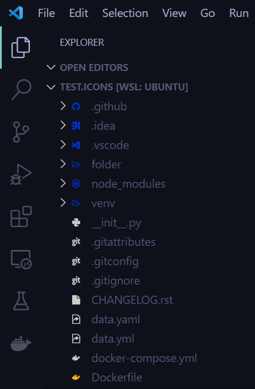

<h1 align='center'> EXA Minimal Fileicons</h1>
<h4 align='center'>A minimal fileicons inspired by exa</h4>
 

*This theme was build based on the way [exa - a modern replacement for ls](https://github.com/ogham/exa#readme) renders icons.*

## Examples:

## Roadmap:
* replace static fileicons map with a script that will generate them on the fly
* generate colors depending on the backgound color
